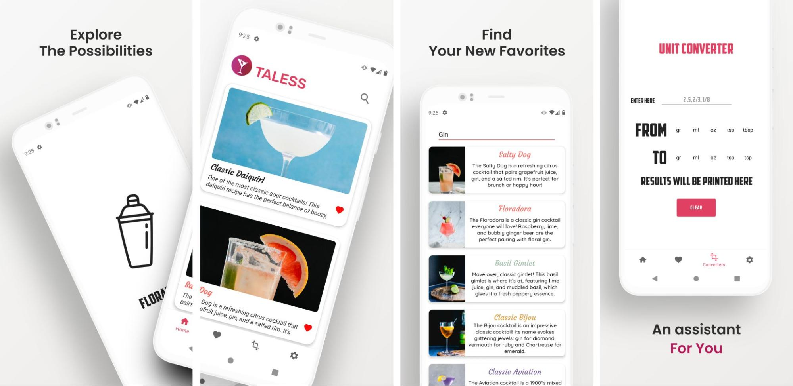
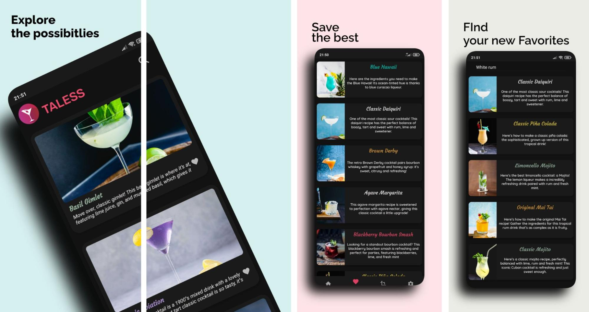

<!-- PROJECT LOGO -->
<br />
<p align="center">
  <a href="https://github.com/github_username/repo_name">
    
  </a>

  <h3 align="center">TALESS - Cocktails</h3>

  <p align="center">
    A Cocktails App
    <br />
    <a href="https://github.com/ShadehaterCS/TheMessengerProject/issues">Report Bug</a>
    ·
    <a href="https://github.com/ShadehaterCS/TheMessengerProject/issues">Request Feature</a>
  </p>
</p>

# TALESS
<!-- TABLE OF CONTENTS -->
## Table of Contents

* [About the Project](#about-the-project)
  * [Built With](#built-with)
* [Themes](#themes)
* [Getting Started](#getting-started)
  * [Prerequisites](#prerequisites)
  * [Installation](#installation)
* [License](#license)


<!-- ABOUT THE PROJECT -->
## About The Project
**An android app to show and instruct how to create specific cocktails**  
**Built as part of a semester project for the *Developing Mobile Apps* class of AUTH**

### Built With
* []()Android Studio
* []()Java 8
* []()Min-API : 27

### Themes
<br />
<p align="center">
  <h3 align="center">Light Theme</h3>
    
    </p>
 <br />
 <br />
<p align="center">
  <h3 align="center">Dark Theme</h3>
    
    </p>
 <br />

### Installation
1. Clone the repo
```sh
git clone https://github.com/ShadehaterCS/TALESS-Cocktails.git
```
2. Emulator with at least API 27  
3. Sync gradle project

### License
Distributed under the Apache License. See `LICENSE` for more information.
<!-- MARKDOWN LINKS & IMAGES -->
<!-- https://www.markdownguide.org/basic-syntax/#reference-style-links -->
[issues-url]: https://github.com/ShadehaterCS/TALESS-Cocktails/issues
[license-url]: https://github.com/ShadehaterCS/TALESS-Cocktails/blob/master/LICENSE
